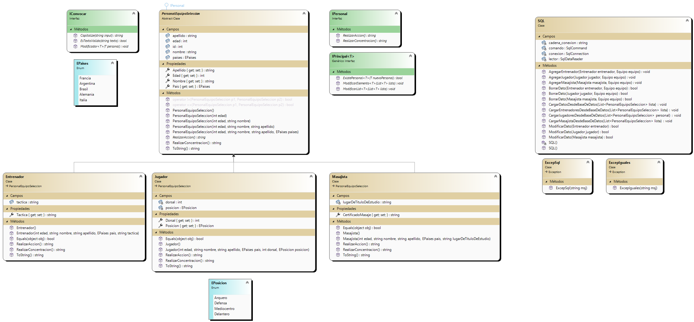
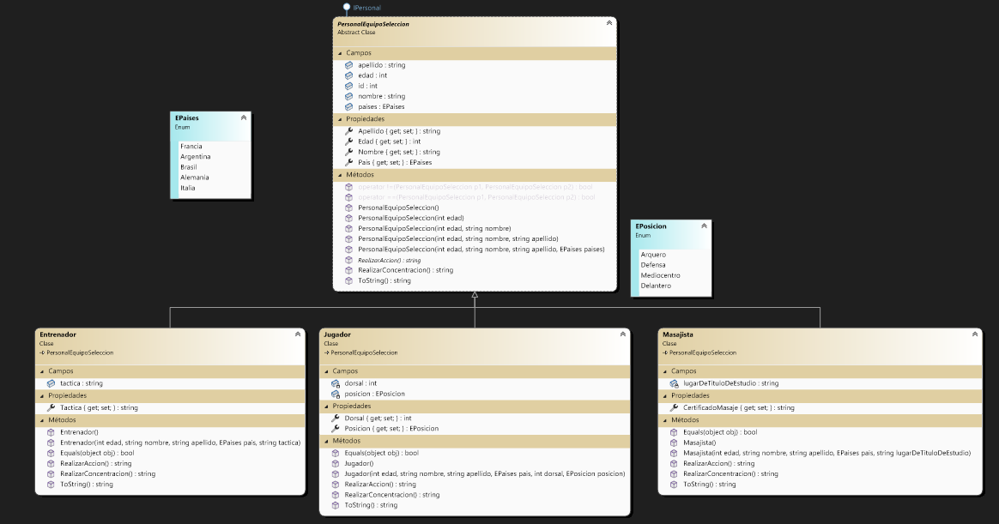
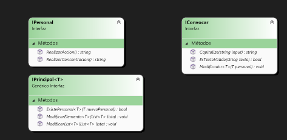

## CRUD - Personal de Selecciones de Futbol

## Sobre mi
me llamo Franco Quiró entre a la facultad en el primer cuatrimestro del 2023, practicamente antes de entrar no sabia nada de programacion, ni siqueiera sabia si era algo que me iba a gustar,con el curso de ingreso me di cuenta que era a lo que me queria dedicar. El cuatrimestre pasado tuve muchas complicaciones para dedicarle el tiempo necesario a este, lamentablemente mi abuela sufrio un acv que hizo que me tenga que centrar mas en ella que la faculta. Eso no quiere decir que no me haya ido mal, todo lo contrario, pude promocionarla materia bastante tranqui y haciendo un juego que me lleno de orgullo al concretarlo ya que fue un reto el tema de hacer un juego de peleas al estilo StreetFighters en algo tan basico como Pygame (ademas que nos pedian un juego de plataformas)

Terminando, todavia soy una persona muy pobre en esto de la programacion pero con ganas de aprender cada dia mas y mas.

## Resumen - Como funciona la app
Esta aplicación sirve como una herramienta para gestionar la información del personal de las distintas selecciones de fútbol. Permite agregar, eliminar y modificar jugadores, entrenadores y masajistas, organizándolos por país a través de un Enum de países. En resumen, esta aplicación actúa como una base de datos centralizada para el personal de las selecciones nacionales, simplificando el proceso de convocatoria y gestión de equipos.

## Digrama de clases:

### Lo separo en imagenes mas chico para que veas mejor:

- #### Diagrama principal:
- 

- #### Interfaces:

- 

### Clase donde manejo la base de datos de SQL mas excepciones:

## Diseño de mi Form

- #### Login:

- 

- #### Form principal de mi aplicacion

- 
